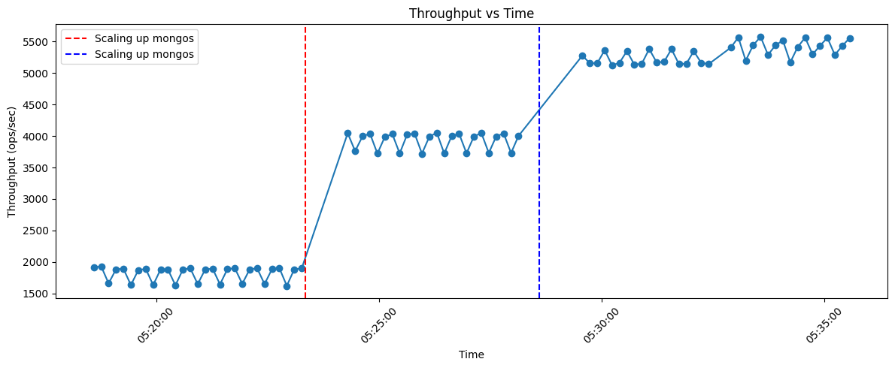
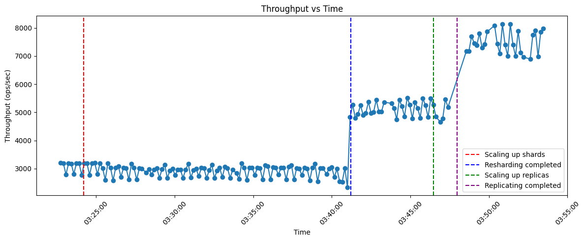

# Mambo: Horizontal Autoscaler for MongoDB

## Overview

Mambo is a horizontal autoscaler designed specifically for MongoDB, built primarily on top of the Bitnami MongoDB-Sharded Helm Chart. The autoscaler depends on the Bitnami setup for deploying and managing MongoDB sharded clusters.

This repository is organized into two main folders:

- **MongoDB**: Contains experiment results and their corresponding setup files.
- **MongoDBOperator**: Contains the source code for the autoscaler operator.


## Key Autoscaling Results

Our autoscaler has been evaluated in a variety of scenarios, demonstrating its effectiveness in improving MongoDB cluster performance and resource efficiency. Below are highlights from our experiments (see `MongoDB/result/Autoscaling.ipynb` for full details and plots):

- **Mongos Autoscaler (CPU-bounded):**
   - The autoscaler dynamically adjusted the number of mongos routers based on CPU load, ensuring consistent query performance and efficient resource usage.
  
   

- **Mongod Autoscaler (CPU-bounded and disk I/O-bounded):**
   - The autoscaler scaled both shards and replicas in response to CPU and disk I/O pressure, maintaining high throughput and low latency even under varying workloads.
  
   

These results show that our operator can:
- Automatically adapt to changing workloads
- Improve throughput and reduce latency
- Optimize resource usage without manual intervention

Adopting this operator can help you achieve robust, hands-off scaling for your MongoDB sharded clusters.

## MongoDB Sharded Cluster Setup

> **Note:** The autoscaler requires your MongoDB sharded cluster to be deployed using the Bitnami Helm Chart. Ensure you follow the Bitnami setup instructions below for compatibility.

1. **Add the Bitnami Helm repository:**
   ```sh
   helm repo add bitnami https://charts.bitnami.com/bitnami
   helm repo update
   ```
2. **Create a `values.yaml` file**
   - This file should contain your cluster configuration, including the number of shards and replicas.
   - You can find an example `values.yaml` file in the `MongoDB` folder of this repository to help guide your setup.
3. **Install the Helm chart:**
   ```sh
   helm install my-mongodb-sharded bitnami/mongodb-sharded -f values.yaml
   ```


### Verifying Deployment and Troubleshooting

After deploying the MongoDB sharded cluster, verify that all pods are running and ready:

```sh
kubectl get pods
```

If any pod remains in a "Pending" state (commonly due to unbound PersistentVolumeClaims), review your storage configuration:

- Ensure the storage class specified in your `values.yaml` exists:
   ```sh
   kubectl get storageclass
   ```
- Confirm the storage class supports dynamic provisioning, or manually create a PersistentVolume that matches your claim requirements.

## Autoscaler Operator Setup

1. **Install Prometheus stack:**
   ```sh
   helm repo add prometheus-community https://prometheus-community.github.io/helm-charts
   helm repo update
   helm install kps prometheus-community/kube-prometheus-stack -n monitoring --create-namespace
   ```
2. **(Optional) Install MongoDB Exporter:**
   ```sh
   kubectl apply -f mongodb-exporter-deployment.yaml
   kubectl apply -f mongodb-exporter-service.yaml
   kubectl apply -f mongodb-exporter-servicemonitor.yaml
   ```
3. **Install the Operator:**
   ```sh
   kubectl apply -f dist/install.yaml
   ```
4. **Create mongos Autoscaler:**
   ```sh
   kubectl apply -f config/samples/autoscaler_v1alpha1_mongosautoscaler.yaml
   ```

   **Parameters in `mongosautoscaler.yaml`:**
   - `router.name`: Name of the mongos router service.
   - `router.namespace`: Namespace where the router is deployed.
   - `scaleBounds.minReplicas` / `scaleBounds.maxReplicas`: Minimum and maximum number of mongos router replicas.
   - `policy.cpuTargetPercent`: Target CPU usage percentage for scaling decisions.
   - `policy.cpuTolerancePercent`: Allowed deviation from the target CPU usage before scaling is triggered.
   - `policy.window`: Time window for evaluating metrics.
   - `policy.cooldownSeconds`: Cooldown period between scaling actions.
   - `prometheus.url`: Prometheus server URL for metrics scraping.
   - `prometheus.nodeExporterPort`: Port for node exporter metrics.
5. **Create mongod Autoscaler:**
   ```sh
   kubectl apply -f config/samples/autoscaler_v1alpha1_mongodautoscaler.yaml
   ```

   **Parameters in `mongodautoscaler.yaml`:**
   - `bitnami.releaseName`: Name of the Bitnami MongoDB-Sharded release.
   - `bitnami.namespace`: Namespace where the MongoDB cluster is deployed.
   - `bitnami.servicePort`: Service port for MongoDB.
   - `shardScaleBounds.minShards` / `shardScaleBounds.maxShards`: Minimum and maximum number of shards.
   - `replicaScaleBounds.minReplicas` / `replicaScaleBounds.maxReplicas`: Minimum and maximum number of replicas per shard.
   - `policy.cpuTargetPercent`: Target CPU usage percentage for scaling decisions.
   - `policy.cpuTolerancePercent`: Allowed deviation from the target CPU usage before scaling is triggered.
   - `policy.iowaitTargetPercent`: Target IO wait percentage for scaling decisions.
   - `policy.iowaitTolerancePercent`: Allowed deviation from the target IO wait before scaling is triggered.
   - `policy.writeHeavyTargetPercent`: (Optional) Target percentage for write-heavy workloads. This parameter is only applicable if the MongoDB Exporter is deployed. If you do not deploy the MongoDB Exporter, omit this parameter from your configuration.
   - `policy.window`: Time window for evaluating metrics.
   - `policy.cooldownSeconds`: Cooldown period between scaling actions.
   - `prometheus.url`: Prometheus server URL for metrics scraping.
   - `prometheus.nodeExporterPort`: Port for node exporter metrics.
